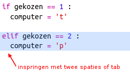
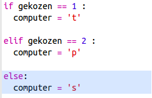
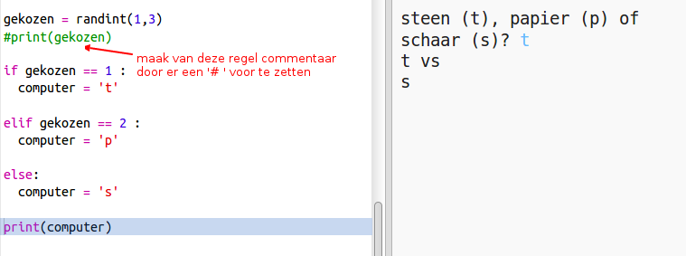

## Computer's beurt

Nu is het de beurt aan de computer. Je kunt de functie `randint` gebruiken om een ​​willekeurig getal te genereren om zo te kiezen tussen steen, papier en schaar.

+ Gebruik `randint` om een ​​willekeurig getal te genereren om te beslissen of de computer steen, papier of een schaar heeft gekozen.
    
    

+ Voer het script een paar keer uit (je steeds weer 't', 'p' of 's' invoeren.)
    
    Je zou moeten zien dat 'gekozen' willekeurig wordt ingesteld op 1, 2 of 3.

+ Laten we zeggen dat:
    
    + 1 = steen (t)
    + 2 = papier (p)
    + 3 = schaar (s)
    
    Gebruik `if` om te controleren of het gekozen nummer `1` is (`==` is om te zien of 2 dingen hetzelfde zijn).
    
    

+ Python gebruikt **inspringing** (de code naar rechts verplaatsen) om aan te geven welke code binnen `if` hoort. Je kunt twee spaties gebruiken (tik twee keer op de spatiebalk) of de **tab-toets** (meestal boven CAPSLOCK op het toetsenbord)
    
    Zet `computer` op 't' binnen `if` door in te springen:
    
    

+ Je kunt een alternatieve controle toevoegen met `elif` (afkorting voor *else if*):
    
    
    
    Deze voorwaarde wordt alleen gecontroleerd als de eerste voorwaarde niet klopt (als de computer niet `1` heeft gekozen)

+ En ten slotte, als de computer niet voor `1` of `2` heeft gekozen, moet het `3` hebben gekozen.
    
    Nu kunnen we gewoon `else` gebruiken, wat 'anders' betekent.
    
    

+ In plaats van het willekeurige nummer af te drukken dat de computer heeft gekozen, kunt u de brief nu afdrukken.
    
    
    
    U kunt de regel `afdrukken (gekozen)`verwijderen of de computer negeren door een `#` aan het begin van de regel toe te voegen.

+ Test uw code door op Uitvoeren te klikken en uw optie te kiezen.

+ Hmm, de keuze van de computer wordt afgedrukt op een nieuwe regel. Je kunt dit oplossen door `end = ''` toe te voegen na `vs`, waarmee Python eindigt met een spatie in plaats van een nieuwe regel.
    
    

+ Speel het spel een paar keer door op Uitvoeren te klikken en een keuze te maken.
    
    Want nu zul je moeten bepalen wie er gewonnen heeft. Vervolgens voeg je de Python-code toe om dit uit te werken.